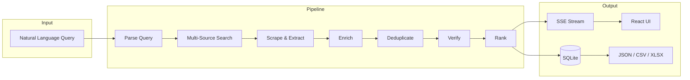

<div align="center">

# ◈ Atlas Research

### AI-powered business intelligence with source-attributed, hallucination-resistant data

[](LICENSE)
[](https://www.python.org/)
[](https://fastapi.tiangolo.com/)
[](https://react.dev/)
[](#real-time-pipeline)

**Discover → Scrape → Enrich → Dedup → Verify → Rank → Export**

[Quick Start](#-quick-start) · [Architecture](#-architecture) · [API](#-api-reference) · [Configuration](#-configuration) · [Docker](#-docker)

</div>

---

## Why Atlas?

Most "AI business scrapers" dump LLM guesses into a spreadsheet. **Atlas Research is different.**

| Typical scraper | Atlas Research |
|-----------------|----------------|
| Single source (SerpAPI or Google) | **8+ parallel sources** |
| LLM fills missing fields freely | **Source URL required** — unsourced fields stripped |
| Duplicate rows everywhere | **Fuzzy dedup + LLM merge** |
| Random result order | **Trust-weighted ranking** |
| Static JSON dump | **Live SSE pipeline + research report** |
| No proof | **Per-field source attribution** |

> We don't claim *zero* hallucination. We use an **anti-hallucination policy**: every displayed field must trace back to a real URL. That dramatically reduces hallucination compared to typical LLM scrapers.

---

## ✨ Features

### 🔍 Multi-Source Discovery
Parallel bootstrap from SerpAPI, Firecrawl, [Omkar Google Scraper](https://github.com/omkarcloud/google-scraper), DuckDuckGo, YellowPages, Yelp, Google Maps, Bing, and directory sites.

### 🛡️ Hallucination-Resistant Extraction
`field_validator` strips any value without a `source_urls` entry. If it can't be proven on the web, it doesn't appear in results.

### 🔗 Cross-Source Verification
Field-level verification with statuses: `highly_verified` · `verified` · `unverified` · `conflicted`.

### 🧬 Smart Deduplication
Phone normalization → rapidfuzz fuzzy matching → LLM confirmation → intelligent record merge.

### 📊 Trust-Weighted Ranking
Composite `rank_score` based on verification status, source reliability, field completeness, ratings, and multi-source coverage.

### 📡 Real-Time Pipeline
Server-Sent Events stream progress through six phases as businesses are discovered, verified, and ranked.

### 📋 Research Report
Data quality percentages, active sources, per-field source recommendations, and top-ranked businesses.

### 📤 Export
Download results as **JSON**, **CSV**, or **Excel**.

### 🔄 Proxy Pool (Optional)
Rotating proxies via [proxy-in-a-box](https://github.com/naiba/proxy-in-a-box) to reduce CAPTCHAs and IP blocks.

### 🤖 LLM Router
LiteLLM auto-failover: **Ollama → Groq → Mistral → OpenAI** — run fully local with Ollama or boost speed with cloud APIs.

---

## 🏗 Architecture



### Pipeline Phases

| Phase | Agent | What happens |
|-------|-------|--------------|
| **1. Parse** | LLM Router | Extract category + location from natural language |
| **2. Search** | SearchAgent | Parallel URL discovery across 8+ sources |
| **3. Scrape** | ScraperAgent | crawl4ai + Playwright + Firecrawl extraction |
| **4. Enrich** | EnrichmentAgent | Official websites, social profiles, extra fields |
| **5. Dedup** | DedupAgent | Phone match + fuzzy names + LLM merge |
| **6. Verify** | VerificationAgent | Cross-source field verification + conflict detection |
| **7. Rank** | Ranking Engine | Trust-weighted scoring, sorted results |
| **8. Report** | Data Quality | Completeness metrics + source recommendations |

### Tech Stack

| Layer | Technology |
|-------|------------|
| **Backend** | FastAPI, Pydantic v2, aiosqlite |
| **Scraping** | crawl4ai, Playwright, Firecrawl, Botasaurus |
| **LLM** | LiteLLM (Ollama, Groq, Mistral, OpenAI) |
| **Search** | SerpAPI, DuckDuckGo, custom directory scrapers |
| **Dedup** | rapidfuzz + LLM confirmation |
| **Frontend** | React 18, Vite, Tailwind CSS, TanStack Table |
| **Streaming** | SSE (sse-starlette) |
| **Storage** | SQLite with 24h TTL query cache |
| **Proxy** | proxy-in-a-box (Docker) |

---

## 🚀 Quick Start

### Prerequisites

- **Python 3.10+**
- **Node.js 20+**
- **[Ollama](https://ollama.ai)** (recommended — free local LLM)
- Optional: Docker Desktop

### 1. Clone & configure

```bash
git clone https://github.com/YOUR_USERNAME/atlas-business-search.git
cd atlas-business-search
cp .env.example .env
```

Edit `.env` with your API keys (all optional except for best results):

```env
# Minimum for local-only mode
OLLAMA_MODEL=llama3.2:3b

# Recommended for production-quality results
GROQ_API_KEY=your_groq_key
SERPAPI_KEY=your_serpapi_key
FIRECRAWL_API_KEY=fc-your_firecrawl_key
```

### 2. One-click start (Windows)

```bat
start-dev.bat
```

Opens **http://localhost:3000** with backend on **http://127.0.0.1:8000**.

### 3. Manual start

**Backend:**

```bash
ollama pull llama3.2:3b

cd backend
pip install -r requirements.txt
playwright install chromium
uvicorn main:app --host 127.0.0.1 --port 8000
```

**Frontend:**

```bash
cd frontend
npm install
npm run dev
```

### 4. Run your first search

Open **http://localhost:3000** and search:

```
Money exchange in Madurai
```

Or via API:

```bash
curl -X POST http://localhost:8000/api/research \
  -H "Content-Type: application/json" \
  -d '{"query": "Dentists in Austin", "max_results": 50}'
```

---

## 🐳 Docker

Full stack with proxy pool:

```bash
cp .env.example .env
docker-compose up --build
```

| Service | URL |
|---------|-----|
| Frontend | http://localhost:3000 |
| Backend API | http://localhost:8000/docs |
| Proxy dashboard | http://localhost:8083 |

> **Ollama in Docker:** Set `OLLAMA_BASE_URL=http://host.docker.internal:11434` to use host Ollama.

---

## ⚙ Configuration

Copy `.env.example` → `.env`. Key variables:

### LLM Providers

| Variable | Default | Description |
|----------|---------|-------------|
| `OLLAMA_BASE_URL` | `http://localhost:11434` | Ollama API endpoint |
| `OLLAMA_MODEL` | `gemma4:e2b` | Local model name |
| `OLLAMA_ONLY` | `false` | Restrict to Ollama only |
| `GROQ_API_KEY` | — | Groq cloud LLM (fast, free tier) |
| `MISTRAL_API_KEY` | — | Mistral API |
| `OPENAI_API_KEY` | — | OpenAI fallback |

### Search & Scraping

| Variable | Default | Description |
|----------|---------|-------------|
| `USE_SERPAPI` | `true` | Google Maps local results via SerpAPI |
| `SERPAPI_KEY` | — | [serpapi.com](https://serpapi.com) key |
| `USE_FIRECRAWL` | `true` | Firecrawl markdown scrape + search |
| `FIRECRAWL_API_KEY` | — | [firecrawl.dev](https://firecrawl.dev) key |
| `USE_OMKAR_GOOGLE_SCRAPER` | `true` | Browser-based Google local search |
| `USE_PROXY_POOL` | `true` | Route scrapes through rotating proxies |
| `PROXY_POOL_HTTP` | `http://127.0.0.1:8080` | Proxy gateway |
| `MAX_CONCURRENT_SCRAPERS` | `10` | Parallel browser contexts |
| `MAX_BUSINESSES_PER_QUERY` | `500` | Result cap per job |
| `CACHE_TTL_HOURS` | `24` | Query cache TTL |

---

## 📡 API Reference

Interactive docs: **http://localhost:8000/docs**

| Method | Endpoint | Description |
|--------|----------|-------------|
| `POST` | `/api/research` | Start a research job |
| `GET` | `/api/research/{id}` | Job status + metadata |
| `GET` | `/api/research/{id}/stream` | SSE live event stream |
| `GET` | `/api/results/{id}` | Paginated, sortable results |
| `GET` | `/api/results/{id}/export?format=json\|csv\|xlsx` | Export download |
| `GET` | `/api/health` | Health check |
| `GET` | `/api/llm/status` | Active LLM provider + latency |

### SSE Events

| Event | Payload |
|-------|---------|
| `progress` | `{ phase, progress_pct, message }` |
| `business` | Full `BusinessRecord` as discovered |
| `summary` | Final job stats + research report |
| `error` | Error message |

### Business Record Fields

`business_name` · `address` · `phone[]` · `email[]` · `website` · `working_hours` · `rating` · `review_count` · `services[]` · `specialties[]` · `license_information` · `certifications[]` · `awards[]` · `social_profiles` · `source_urls` · `verification_status` · `rank_score` · `raw_sources[]`

---

## 📁 Project Structure

```
atlas-business-search/
├── backend/
│   ├── agents/           # Orchestrator, search, scrape, dedup, verify
│   ├── scrapers/         # Firecrawl, SerpAPI, directories, Google Maps
│   ├── integrations/     # Omkar Google Scraper
│   ├── llm/              # LiteLLM router + prompts
│   ├── routers/          # FastAPI routes
│   ├── utils/            # Ranking, validation, export, proxy pool
│   ├── main.py
│   └── requirements.txt
├── frontend/
│   └── src/
│       ├── components/   # SearchBar, BusinessTable, ResearchProgress
│       ├── pages/        # Home, Results
│       └── api/          # API client + SSE hook
├── proxy-pool/data/      # proxy-in-a-box config
├── docker-compose.yml
├── start-dev.bat         # Windows one-click dev
├── start-all.bat         # Dev + proxy pool
├── stop-dev.bat
├── .env.example
└── README.md
```

---

## 🖥 Development

### Windows scripts

| Script | Purpose |
|--------|---------|
| `start-dev.bat` | Kill stale ports → start backend + frontend |
| `start-all.bat` | Docker proxy pool + `start-dev.bat` |
| `stop-dev.bat` | Stop processes on ports 8000 & 3000 |

### Proxy pool (standalone)

```powershell
.\scripts\start-proxy-pool.ps1
```

### Build frontend for production

```bash
cd frontend && npm run build
```

### Run a test query

```bash
curl -X POST http://localhost:8000/api/research \
  -H "Content-Type: application/json" \
  -d '{"query": "Cardiologists in Birmingham", "max_results": 25, "llm_provider": "groq"}'
```

---

## 🗺 Roadmap

- [ ] Government license database integrations
- [ ] PostgreSQL / Redis for production scale
- [ ] Scheduled re-research & change detection
- [ ] Webhook notifications on job complete
- [ ] Multi-tenant API keys
- [ ] Kubernetes Helm chart

---

## 🤝 Contributing

Contributions are welcome! Please:

1. Fork the repository
2. Create a feature branch (`git checkout -b feature/amazing-feature`)
3. Commit your changes (`git commit -m 'Add amazing feature'`)
4. Push to the branch (`git push origin feature/amazing-feature`)
5. Open a Pull Request

---

## 🙏 Acknowledgments

Built with and inspired by:

- [crawl4ai](https://github.com/unclecode/crawl4ai) — LLM-ready web crawling
- [LiteLLM](https://github.com/BerriAI/litellm) — Unified LLM API
- [Firecrawl](https://github.com/firecrawl/firecrawl) — Clean markdown extraction
- [Omkar Google Scraper](https://github.com/omkarcloud/google-scraper) — Browser Google search
- [proxy-in-a-box](https://github.com/naiba/proxy-in-a-box) — Rotating proxy pool
- [SerpAPI](https://serpapi.com) — Structured search results

---

## 📄 License

This project is licensed under the [MIT License](LICENSE).

---

<div align="center">

**Built for teams who need business data they can trust — not another hallucinating scraper.**

[⬆ Back to top](#-atlas-research)

</div>
